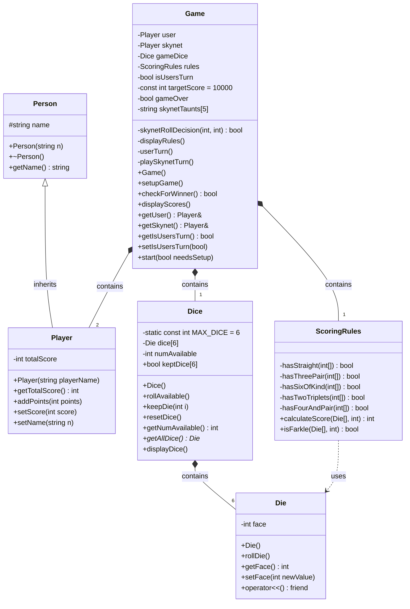

# CS225FARKLE
C++ Terminator Farkle 
An object oriented farkle game for 1 player vs the computer (Skynet). Roll all 6 dice and keep any scoring combinations you choose. Keep rolling remaining dice until you choose to keep your score, or you FARKLE (no scoring combinations).
## UML Class Diagram

